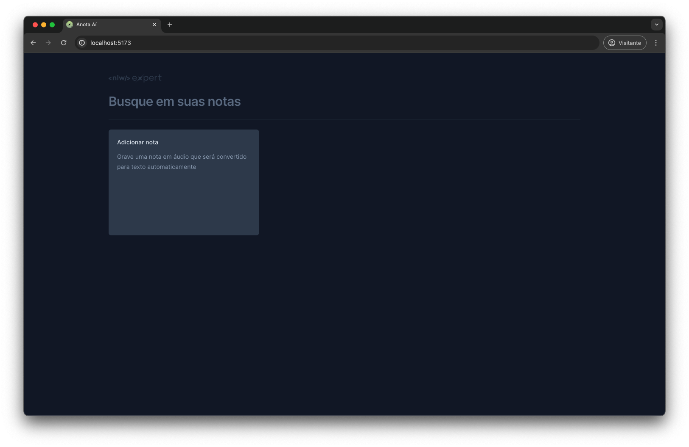

# 📝 anotaAí

  

## 🚀 Introdução

Bem-vindo ao anotaAí, um aplicativo que vai transformar a maneira como você registra suas ideias e pensamentos. Seja para anotar conversas importantes de reuniões, registrar pensamentos aleatórios ou simplesmente para não esquecer de algo, o anotaAí é a ferramenta que você precisa.

## 💡 Sobre o Aplicativo

O anotaAí é uma aplicação simples, desenvolvida em **React JS** e **TypeScript** durante o evento **NLW-Expert**, com o objetivo de aprendizado. Utilizamos o **Talwind** para estilização, proporcionando uma interface de usuário limpa e intuitiva. Além disso, a aplicação é **responsiva**, garantindo uma ótima experiência em qualquer dispositivo.

## 🎯 Recursos

Com o anotaAí, você pode criar notas em áudio ou texto, de acordo com sua preferência. As notas são ordenadas começando pela última criada e são armazenadas no localStorage para fácil acesso. Além disso, o anotaAí possui um recurso de busca que permite encontrar facilmente qualquer nota.

Para a gravação em áudio, utilizamos a API **SpeechRecognition**, compatível com Google Chrome, Safari e Edge. Infelizmente, a API não é compatível com o Firefox, portanto, se você é um usuário do Firefox, recomendamos que use um dos navegadores compatíveis para aproveitar todos os recursos do anotaAí.

## 🛠️ Frameworks Utilizados

Aqui estão alguns dos principais frameworks que usamos no desenvolvimento do anotaAí:

- **Radix-ui**: Usamos este pacote para criar diálogos interativos e acessíveis em nossa aplicação.
- **date-fns**: Este é um moderno pacote JavaScript para manipulação de datas. Usamos isso para lidar com todas as nossas necessidades de data e hora.
- **Lucide**: Este pacote nos fornece um conjunto de ícones bem projetados que usamos em toda a nossa interface de usuário.
- **Sonner**: Usamos o sonner para fornecer feedback auditivo aos usuários durante a interação com a aplicação.

## 🚀 Como Executar

Para executar o anotaAí localmente, siga estas etapas:

1. Clone o repositório para a sua máquina local usando `git clone`.
2. Navegue até o diretório do projeto.
3. Instale as dependências do projeto com `npm install`.
4. Inicie o servidor de desenvolvimento com `npm run dev`.

Agora você deve ser capaz de ver o anotaAí rodando em `localhost:5173` no seu navegador.

Esperamos que você aproveite usar o anotaAí!
